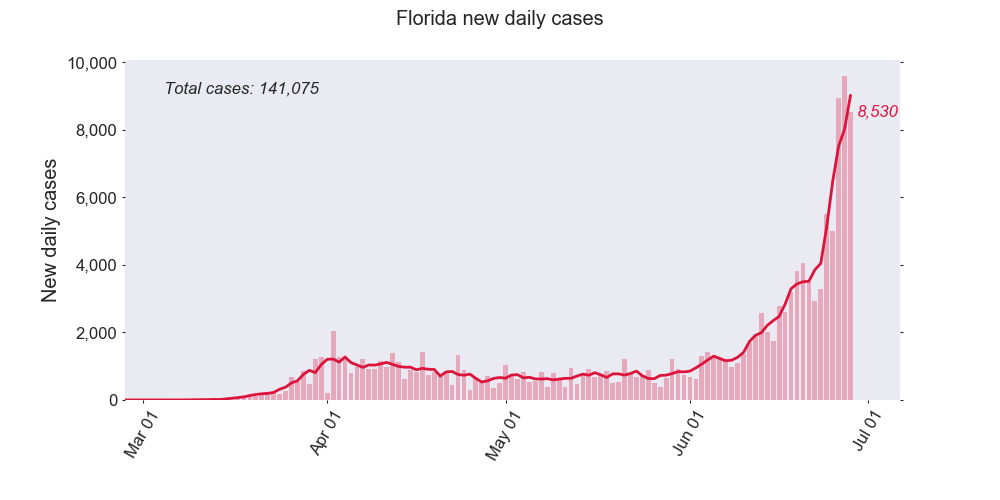

# Covid-19 Plots

## Installation
To install the package and all its dependencies, from the `Covid19scripts`
directory execute:

```
pip install .
```

## Plot types

### Interactive plot
Generate an interactive Bokeh plot to display the daily case numbers for 
USA states. From the `Covid19scripts/covidplots` directory:

```
bokeh serve --show interactive
```

### Grid plots
Generate figures in a grid format with bar plots of new daily cases or deaths
for the following regions:
* USA (all 50 states)
* global (hard-coded list of countries)
* Latin America countries
* EU total vs USA total
* Worst 9 USA states
* Worst 9 countries
"Worst" is defined as the regions with highest number of most recent daily cases. 

To create these plots, from `Covid19scripts/covidplots`:

```
python grid_plots.py
```

to create all plots. Or to specify only certain plots:

```
python grid_plots.py --regions worst_world
```

An example plot is found below.


### Bar plot for a single state/country
Genereate a bar plot for a single state or country, from the 
`Covid19scripts/covidplots` directory:

```
python plot_by_region.py Florida
```



### Overlaid plots
Generate 2 different types of plots for a hard-coded selection of states:
* Case/death numbers vs date
* Case/death numbers vs days since 100 cases/deaths 
Both types of plots are also created with log Y scales and per capita case/death
numbers, creating a total of 8 plots.


